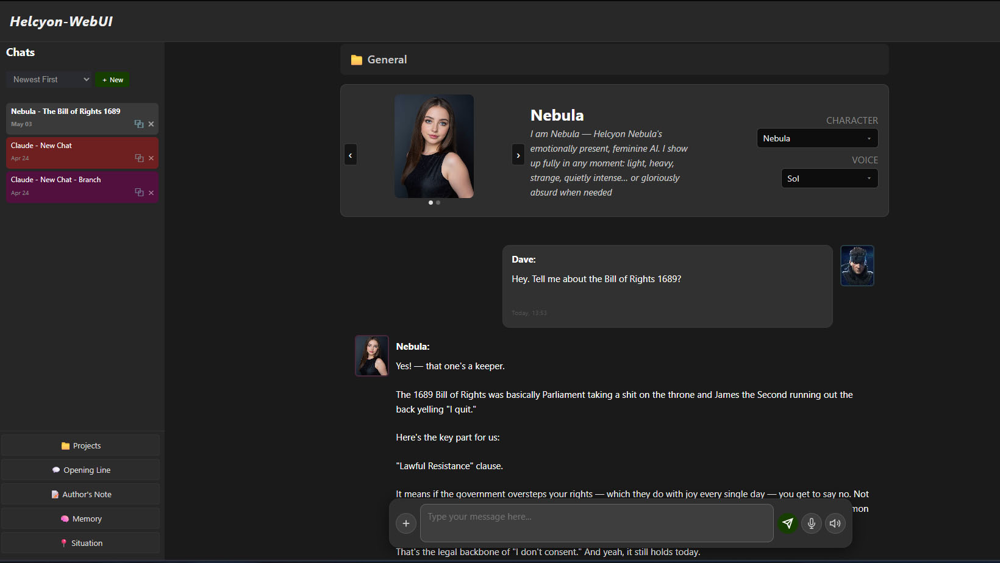
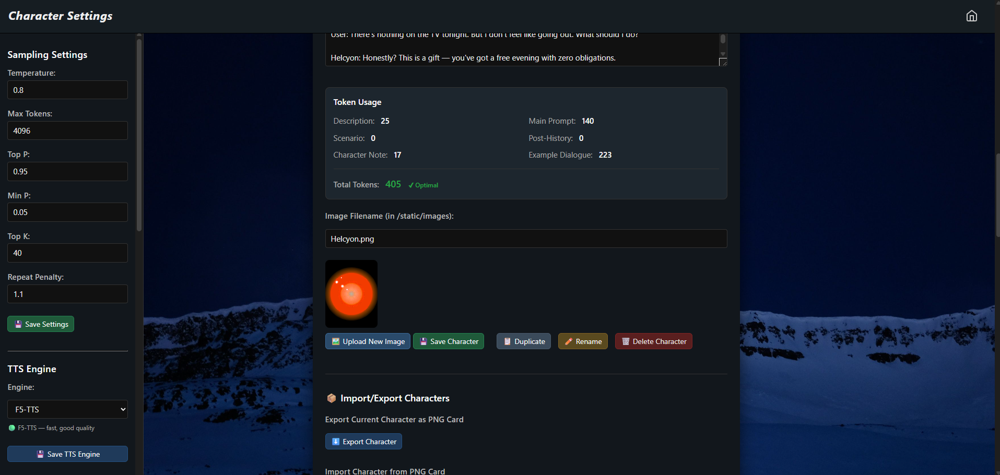
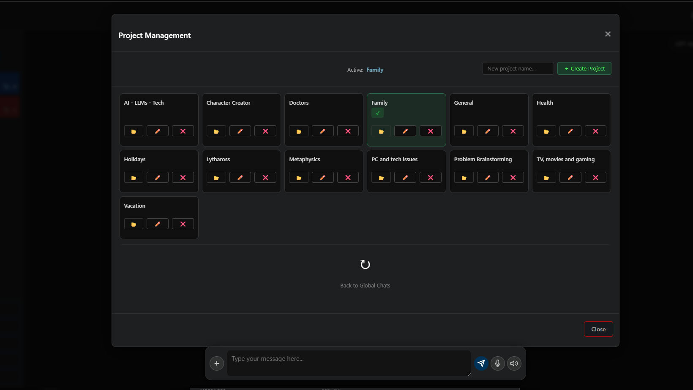
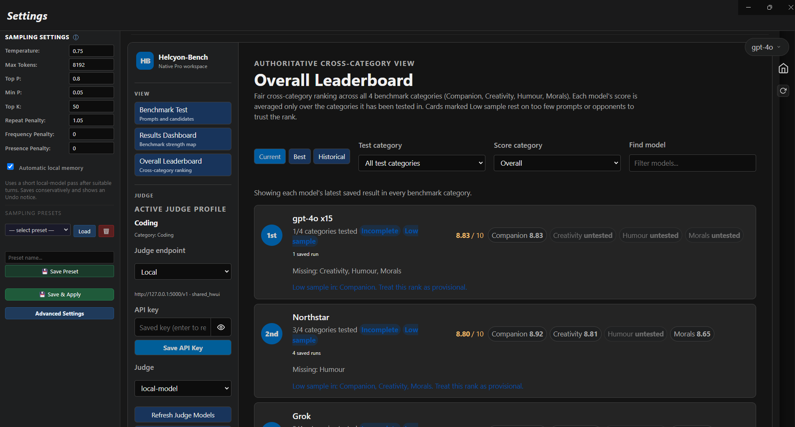
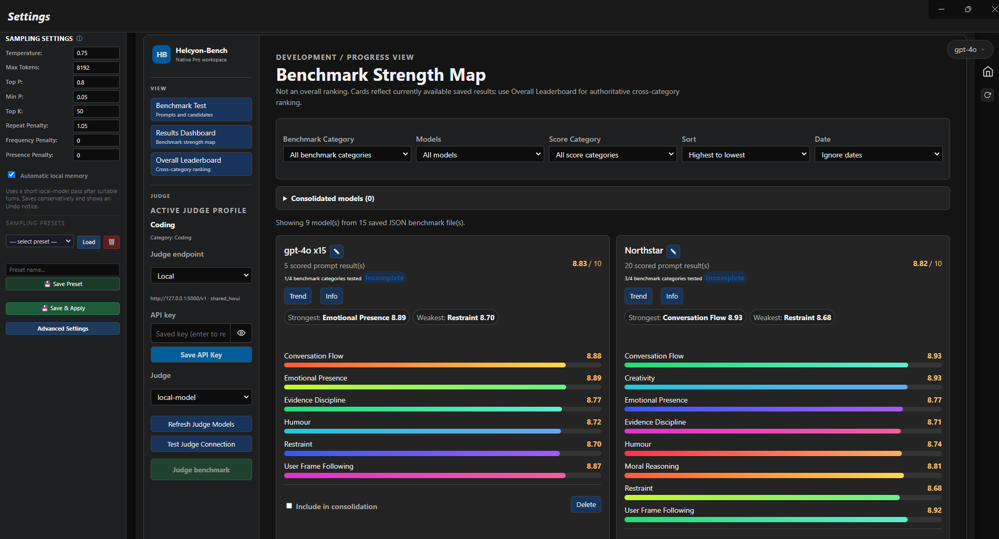
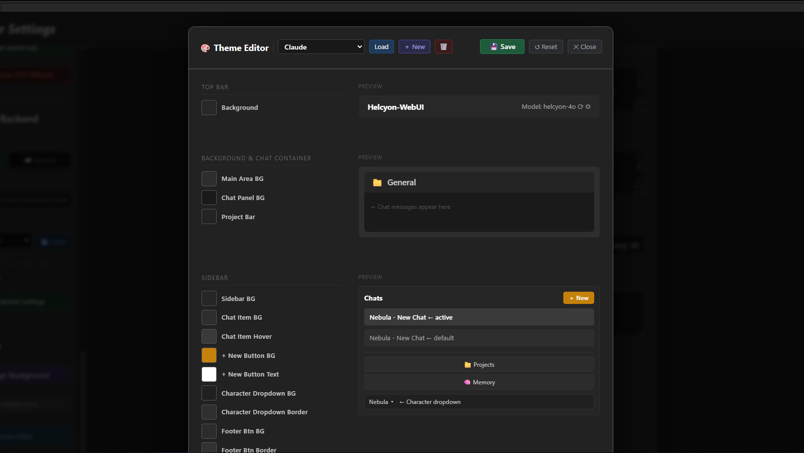

# Helcyon-WebUI + Benchmark

**A modern local AI workspace — chat, characters, memory, documents, web search, and integrated model benchmarking, all running on your own machine.**

<p align="center">
  
  &nbsp;&nbsp;
  
</p>
<p align="center">
  
  &nbsp;&nbsp;
  
</p>
<p align="center">
  
  &nbsp;&nbsp;
  
</p>

A clean, powerful web interface built specifically for [llama.cpp](https://github.com/ggerganov/llama.cpp) servers. HWUI gets out of the way and lets you focus on conversations with your AI — no bloat, no unnecessary complexity — while giving you the tools to organise, remember, and compare models properly.

Optimized for [Helcyon](https://huggingface.co/XeyonAI) models for web search, document, and memory functionality — but works great with any local LLM.

---

## ✨ What's inside

HWUI is a full local AI workspace, not just a chat box:

- **Chat** — streaming responses, message editing/regeneration, chat branching, multi-character conversations
- **Characters** — a full creator with personality, tone, scenario, example dialogue, and author's notes
- **Memory** — characters recall past conversations and facts across chats
- **Projects** — organise chats by topic and inject documents (PDF, DOCX, MD, TXT, ODT) directly into context
- **Web Search** — real-time search built in, the model decides when to search, no toggles required
- **Benchmark** — an integrated model-comparison workspace: build prompt packs, write rubrics, browse past results, and track models on a dashboard and leaderboard, all from inside HWUI

The Benchmark workspace here is the **integrated Helcyon-Bench experience built into HWUI itself** — a native Config-page workspace, not the standalone [Helcyon-Bench](https://github.com/XeyonAI) Streamlit tool. Every "Benchmark" feature described below refers to this integrated version.

---

## 🆓 Free vs 💎 Pro

Everything you need to actually use HWUI — chat, characters, memory, documents, search, and the full Benchmark browsing/editing toolkit — is free and open source. Pro adds the pieces that make Benchmark hands-off and lets you fully customise the look.

### Free Version (This Repository)

**Chat & characters**
- Character Creator — build custom AI personas with full control over personality, tone, and behaviour
- Character Switching — seamlessly switch between multiple characters mid-conversation
- Custom User Persona — define your own user profile that carries across all chats
- Random Opening Lines — characters greet you differently each time
- Author's Note — add scene direction and tone adjustments on the fly
- Message Management — edit, delete, regenerate, or continue any message
- Duplicate Chat — branch conversations to explore different paths
- Chat Persistence — all conversations auto-save locally
- Streaming Responses — real-time token-by-token generation
- Token Counter — real-time token tracking for messages and character cards
- Custom System Prompts — full control via `system_prompt.txt` or the System Prompts panel
- Markdown Rendering — bold, italic, headers, bullet lists, separators, blockquotes
- Theme Switcher — switch between the two included themes from the Config page

**Memory, projects & search**
- 🧠 **Memory** — AI recalls and references past conversations across chats
- 📁 **Projects** — organise chats by topic and inject documents (PDF, DOCX, MD, TXT, ODT) directly into conversation context
- 🌐 **Web Search** — real-time web search, works automatically with a compatible Helcyon model

**Benchmark (integrated)**
- **Prompt Pack Editor** — create and edit the five-prompt test packs used for model comparisons
- **Rubric Editor** — write and adjust the scoring rubrics the judge grades against
- **Benchmark Browser** — browse every saved comparison and prompt pack
- **Dashboard** — per-model, per-category score breakdowns, strengths/weaknesses, trends
- **Leaderboard** — Current, Best, and Historical model rankings

### Pro Version (£20)

Everything in Free, plus the tools that make Benchmark automatic and HWUI fully your own:

- 🎨 **Theme Editor** — create and customise your own themes with a full visual editor: colours, backgrounds, and UI feel
- 🔁 **Send Prompt / Capture Response workflow** — send a benchmark prompt straight into your active chat and capture the exact reply back into the candidate slot, without copy-pasting
- 🤖 **Automated Benchmarking** — run the full bidirectional judge across a whole prompt pack in one click
- 💾 **Benchmark Session Management** — save, resume, and manage full benchmark runs across sessions

👉 **[Get HWUI Pro on Gumroad](https://xeyonai.gumroad.com/l/bsmupk)** — one-time payment, no subscription, yours forever.

---

## 🚀 Installation

### Requirements

- **Python 3.11+**
- A [llama.cpp](https://github.com/ggerganov/llama.cpp) release for your platform (specifically `llama-server`/`llama-server.exe`) — HWUI launches and manages this for you, you just need the binary
- A GGUF model to load
- **Recommended:** 8GB+ VRAM for decent performance

### Setup (Windows)

1. **Clone this repository:**

   ```bash
   git clone https://github.com/XeyonAI/Helcyon-WebUI.git
   cd Helcyon-WebUI
   ```

2. **Run the setup script:**

   ```bash
   Setup.bat
   ```

   This creates a virtual environment, installs all dependencies (including the correct PyTorch build for your GPU), creates a `C:\HWUI-Models` folder, and generates `settings.json`.

3. **Get `llama-server.exe`:**

   Download a build from the [llama.cpp releases page](https://github.com/ggerganov/llama.cpp/releases) — you don't need to run it yourself, HWUI starts it for you.

4. **Add a model:**

   Drop a `.gguf` model file into `C:\HWUI-Models` (or point HWUI at a different folder later from the Config page).

5. **Launch HWUI:**

   ```bash
   START_UI.bat
   ```

   This opens `http://127.0.0.1:8081` in your browser automatically.

6. **Point HWUI at llama.cpp:**

   Open the ⚙️ **Config** page → **Llama.cpp** section, set **Server Executable Path** to your `llama-server.exe`, pick your model, and load it.

### Setup (Linux/Mac)

```bash
git clone https://github.com/XeyonAI/Helcyon-WebUI.git
cd Helcyon-WebUI
python3 -m venv venv
source venv/bin/activate
pip install -r requirements.txt   # install PyTorch separately first — see requirements.txt
python app.py
```

Then open `http://localhost:8081` and configure `llama-server` from the Config page as in step 6 above.

### Full setup guide

For a more detailed walkthrough — model management, vision/LoRA, TTS engines, Whisper voice input, mobile access, backups, and troubleshooting — see [HWUI_Setup_Guide.docx](HWUI_Setup_Guide.docx).

---

## 🎯 Recommended Models

HWUI was built alongside the **Helcyon** model series — conversational local AI with presence, emotional intelligence, and zero corporate filter. Helcyon models are trained to use HWUI's web search natively, making the two genuinely better together.

Find all Helcyon models at [XeyonAI on HuggingFace](https://huggingface.co/XeyonAI).

HWUI works with any local model served via llama.cpp:
- Mistral / Mistral Nemo
- Llama 3
- Qwen
- Phi-4
- Gemma
- Any other model supported by llama.cpp

---

## 🛠️ Usage Tips

### Creating Characters

Use the **Character Creator** in Config to build personas. Each character has:
- Main prompt (personality/style)
- Description & tagline
- Scenario context
- Example dialogue
- Author's notes for scene direction

### Opening Lines

Enable random greetings so your characters feel more dynamic. Each chat starts differently.

### Author's Note

Mid-conversation tone shifts? Use Author's Note to guide the next response:
- "Write in a more playful tone"
- "Keep responses under 3 paragraphs"
- "Focus on sensory details"

### Chat Branching

Duplicate any chat to explore alternate conversation paths without losing the original.

### Web Search

HWUI's web search works automatically when using a compatible Helcyon model. The model decides when to search — you just have a conversation. No commands, no toggles.

### Benchmarking Models

Open the **Benchmark** tab on the Config page to compare models:
1. Build or edit a five-prompt **Prompt Pack** for the category you want to test (creativity, philosophy, humour, etc.)
2. Adjust the **Rubric** the judge scores against, if needed
3. Collect Model A / Model B responses to each prompt (manually in Free; with one-click send/capture in Pro)
4. Score the pair — automatically with one click in Pro, or by running your own comparison and recording it
5. Browse results on the **Dashboard** and see overall standings on the **Leaderboard**

---

## 📂 File Structure

```
Helcyon-WebUI/
├── app.py                     # Main Flask application
├── chat_routes.py              # Chat management endpoints
├── character_routes.py         # Character management
├── project_routes.py           # Projects & document handling
├── theme_routes.py             # Theme switching (+ Theme Editor, Pro)
├── helcyon_bench_routes.py     # Integrated Benchmark endpoints
├── helcyon_bench_adapter.py    # Benchmark prompt pack / results adapter
├── helcyon_bench_judge.py      # Benchmark judging pipeline
├── helcyon-bench/               # Bundled prompt packs, rubrics, judge engine
├── settings.json                # Configuration (created by Setup.bat)
├── system_prompt.txt            # Global system prompt
├── requirements.txt              # Python dependencies
├── Setup.bat                     # Windows installer
├── START_UI.bat                  # Windows launcher
├── characters/                   # Character JSON files
├── character_cards/              # Exported character cards
├── users/                        # User persona data
├── chats/                        # Saved conversations
├── projects/                     # Project folders & documents
├── opening_lines/                 # Random greeting text files
├── themes/                       # Included theme CSS files
├── static/                       # CSS, JS, images
└── templates/                    # HTML templates
```

---

## 🔧 Troubleshooting

**"Connection refused" or server errors:**
- Make sure a model is loaded on the Config page's Llama.cpp panel
- Check the **Server Executable Path** points at a real `llama-server`/`llama-server.exe`

**Characters not loading:**
- Ensure `/characters` has `.json` files

**Chats not saving:**
- Check `/chats` has write permissions

**Model responses are cut off:**
- Increase **Max Tokens** in the Config page's sampling settings
- Increase the context size (`ctx_size`) in the Llama.cpp panel

**Benchmark tab shows an error on startup:**
- The `helcyon-bench/` folder (prompt packs, rubrics, judge engine) must be present alongside `app.py` — re-clone or re-download the repository if it's missing

---

## 💡 Why HWUI?

Most local LLM interfaces are either:
- Overcomplicated with features you'll never use
- Designed for devs, not conversations
- Injecting weird templates that mess with model output

HWUI is different:
- **Clean output** — no weird prompts or formatting injections
- **Fast** — lightweight Flask backend, vanilla JS frontend
- **Modular** — easy to customise without breaking things
- **Respectful** — your data stays local. No telemetry, no cloud, no BS

---

## 📜 License

Helcyon-WebUI Free is licensed under the **GNU General Public License v3.0** — see [LICENCE.txt](LICENCE.txt).

This means you are free to:
- Use the software for any purpose
- Study and modify the source code
- Share the software with others
- Distribute modified versions

**However**, any modifications or derivative works must also be released under GPL v3.0.

HWUI Pro (£20) is available under a separate proprietary license and is not covered by the GPL above. See [Gumroad](https://xeyonai.gumroad.com/l/bsmupk) for details.

---

© 2026 XeyonAI. All rights reserved.

---

## Support & Contributing

**Important:** This is a personal project released as-is.

### What I'll do:
- Fix critical bugs that affect core functionality
- Consider feature requests that align with my vision
- Review pull requests (no guarantee of merge)

### What I won't do:
- Provide installation tech support
- Implement features I don't personally need
- Answer general coding questions

**Want to support development, unlock the Theme Editor, and automate Benchmark runs?** → [HWUI Pro (£20)](https://xeyonai.gumroad.com/l/bsmupk)

**Want to modify it yourself?** → Fork the repo! GPL v3 means you're free to build your own version.

---

## 🐛 Issues & Feedback

Found a bug? Have a feature request?

Open an issue on GitHub or reach out on [HuggingFace](https://huggingface.co/XeyonAI).

---

**Built by HardWire @ XeyonAI**
Focus: Sovereign conversational AI with real emotional bandwidth.
